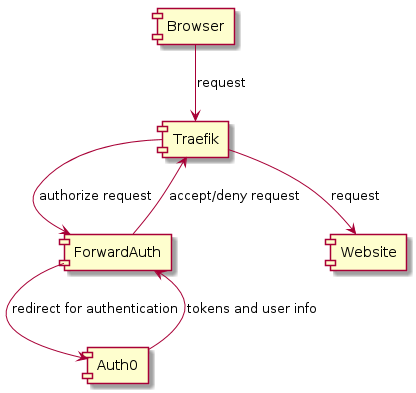

# Overview

## Diagrams
### Component diagram

### Sequence diagram

### Authorization activity diagram

### Authentication activity diagram

## API Endpoints
The ForwardAuth-backend exposes by default the following application endpoints on the port 8080. 
### Authorize
Return 200 OK if user is authorized to access the requested URL, this is the endpoint used by Traefik to 
decide to let the request through to the target website or deny access. If denied access it will redirect to
the authorization url at Auth0 to perform authorization. Will verify that the access token and id-token set in
browser session is valid.

### Signin
The callback URL that Auth0 redirects after the user has authorized the requst and signed in.
Will set the Session Cookies in the browser with Access Token and ID-Token to hold the current user session 
between http request.

### Signout
Call this endpoint when logged in to remove the session cookies from your browser and call Auth0 logout endpoint
which will log out your session in Auth0 as well.

### Userinfo
Call this endpoint when logged in to retrieve user information.
